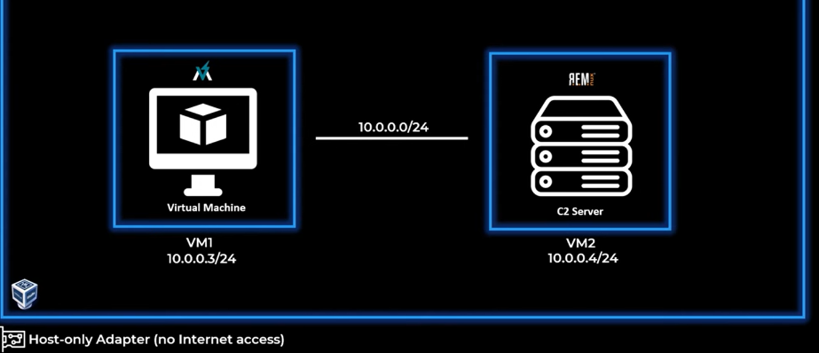

# Self-Hosted Malware Analysis Lab

This guide provides step-by-step instructions for setting up a self-hosted malware analysis lab using two virtual machines (VMs): one for malware analysis and one running Windows. The steps involve downloading and configuring the necessary tools, including REMnux and FlareVM, and setting up network interactions between the machines.

## Topology




The setup consists of two virtual machines:
- **VM 1**: Windows (for malware execution and analysis).
- **VM 2**: REMnux (for network simulation and analysis).

### Prerequisites

1. Install [VirtualBox](https://www.virtualbox.org/) or another preferred hypervisor.
2. Ensure sufficient storage and memory for two virtual machines.

---

## Steps to Set Up the Lab

### Step 1: Download Windows Enterprise ISO (64-bit)

1. Download the Windows 10 Enterprise ISO from the Microsoft Evaluation Center:
   - [Windows 10 Enterprise ISO](https://www.microsoft.com/en-us/evalcenter/download-windows-10-enterprise)
   - Alternatively, use this direct download link: [Download Link](https://go.microsoft.com/fwlink/p/?LinkID=2208844&clcid=0x409&culture=en-us&country=US)

### Step 2: Install REMnux

1. Follow the official REMnux installation guide to install the virtual appliance:
   - [REMnux Installation Guide](https://docs.remnux.org/install-distro/get-virtual-appliance)
2. Download the REMnux virtual appliance:
   - [REMnux Download](https://app.box.com/s/8matvs5l0gc8vkr4xfq3szdm7mc9o0ad)

### Step 3: Install Windows on the VM

1. Set up the Windows VM using VirtualBox.
2. Choose **Custom** installation.
3. Create a new partition using the default settings and proceed with the installation.
4. Wait for the installation to complete.
5. Disable all privacy settings during setup.

*Optional*: Install VirtualBox Guest Additions to enable fullscreen rendering.

### Step 4: Set Up the Browser

1. Download and install your preferred web browser (e.g., [Google Chrome](https://www.google.com/chrome/)).

### Step 5: Install FlareVM on Windows VM

1. Disable the following security settings in Windows:
   - **Proxy settings**
   - **Windows Defender**

2. Modify Group Policy to disable antivirus and firewall:
   - Open **Group Policy Editor** (`gpedit.msc`):
     - Navigate to `Computer Configuration -> Administrative Templates -> Windows Components -> Microsoft Defender Antivirus`.
     - Set **Turn off Microsoft Defender Antivirus** to **Enabled**.
   - Disable the Firewall:
     - Go to `Computer Configuration -> Administrative Templates -> Network -> Network Connections -> Windows Firewall`.
     - Under **Domain Profile** and **Standard Profile**, disable **Protect all network connections**.

3. Create a snapshot of your Windows VM:
   - In VirtualBox, select `Machine -> Take Snapshot` to save the current state.

4. Open **PowerShell** as an administrator and go to your desktop:
   ```powershell
   cd C:\Users\YourUserName\Desktop

If the shared folder isn’t visible, enable shared folders:

- Go to **Devices -> Share -> Bi-directional**.

Run the following command to download and install FlareVM:

```powershell
(New-Object net.webclient).DownloadFile('https://raw.githubusercontent.com/mandiant/flare-vm/main/install.ps1',"$([Environment]::GetFolderPath('Desktop'))\install.ps1")

Unblock-File .\install.ps1

Set-ExecutionPolicy Unrestricted

.\install.ps1```

### Step 6: Install REMnux on the VM

1. In VirtualBox, import the REMnux virtual appliance using **CTRL+I**.
2. Once the appliance is imported, start the REMnux VM.

---

### Step 7: Configure Networking Between VMs

1. In VirtualBox, go to **Tools -> Network -> Create** to create a host-only network.
2. Configure the network with the following settings:
   - **IP Address**: `10.0.0.1`
   - **DHCP**: Enable
   - **Server Address**: `10.0.0.2`
   - **Server Mask**: `255.255.255.0`
   - **Address Range**: From `10.0.0.3` to `10.0.0.254`

---

### Step 8: Configure REMnux DNS Settings

1. Log into the REMnux VM.

2. Edit the `inetsim.conf` file:
   ```bash
   cd /etc/inetsim
   sudo nano inetsim.conf
   
3. Uncomment the following lines:
   - `service_bind_address`
   - `dns_default_ip 10.0.0.4`

4. Save and exit (`CTRL+X`, then press `Y`, and hit **Enter**).

---

### Step 9: Set Up Host-Only Network Adapters

1. Open **Settings** for both the Windows and REMnux VMs in VirtualBox.
2. Go to the **Network** tab and set **Adapter 2** to **Host-Only Adapter**.
3. Select the previously created VirtualBox network adapter.
4. Repeat this process for both the Windows and REMnux VMs.

---

### Step 10: Test VM Connectivity

1. On the Windows VM, open **Network Settings** and go to **Change Adapter Settings**.
2. From both the Windows and REMnux VMs, ping the other machine to confirm network communication:
   ```bash
   ping 10.0.0.X

Replace X with the appropriate IP address for each VM. If the pings succeed, the machines are connected and ready for malware analysis.


